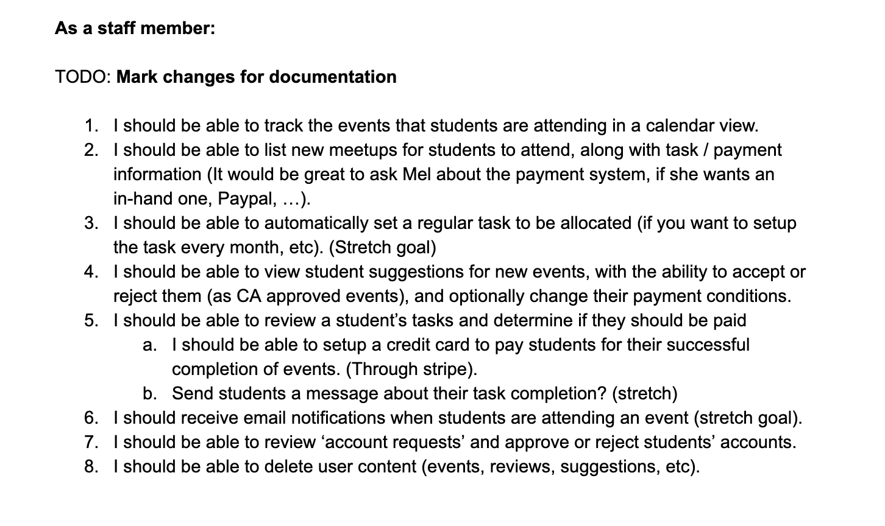
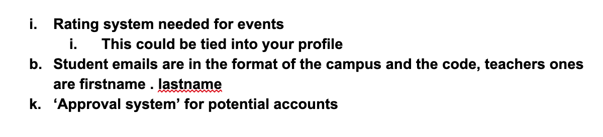
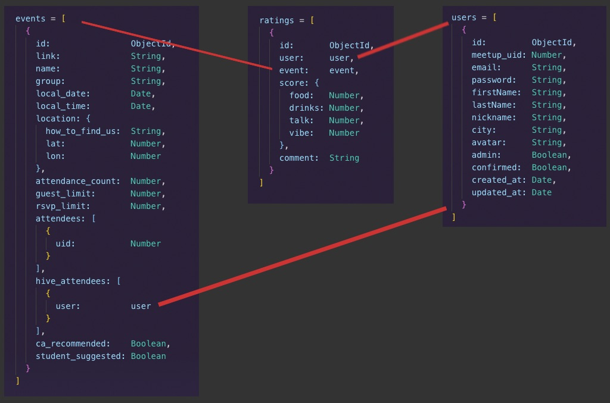

# Readme - The Hive

## The Code
*Separate your program into modules that each deal with one particular focus, or concern.-Excellent and complete separation of concerns demonstrating a strong understanding of software design*

*Demonstrate DRY (Don’t Repeat Yourself) principles in all code.-Excellent use of DRY principles, every piece of knowledge has a single, unambiguous, authoritative representation*

*Demonstrate use of functions--Meets D with clearly commented code; use of functions clearly improves code serviceability and maintenance*

*Apply Object oriented principles/patterns--Superior use of object oriented principles/patterns; use of OO principles/patterns throughout application with positive impact on code maintainability and serviceability*

*Code structure--Shows exceptional understanding of folder structure and file naming conventions, adheres to all MERN best practices and conventions*

*Code style --The code adheres to all team standards. The code is exceptionally well organised and very easy to follow. Comments are complete and useful; variables' and functions’ purposes are clearly communicated by their names.*

*Async implementation--Exceptional understanding of async patterns, e.g. expert use of promises and callbacks*

*Recognise, identify and utilise classes--Utilises highly sophisticated classes, demonstrating an exceptional level of understanding; Extensive use of prototypes/inheritance*

*Recognise, identify and utilise functions--Utilises highly sophisticated functions, demonstrating an exceptional level of understanding; Advanced functional programming concepts including Immediately-Invoked Function Expression (IIFE), etc*

*Validation of data (including ranges)--All data is expertly validated using a range of techniques (e.g. regex, etc) and checked; demonstrating an exceptional level of understanding*

*Arrays--Shows thorough understanding of the use-cases of Arrays and utilises them to solve a problem unsolvable otherwise.*

*Objects--Understands, utilises and manipulates Objects using a range of methods to benefit the solution.*

## Project Management

1. Record interactions with your client in a diary format
2. Plan information gathering activities to determine project requirements, constraints and risks
3. Develop project charter, including preliminary statement of project scope and obtain sign-off
4. Prepare project work breakdown and schedule
5. Allocate roles and responsibilities to team members, based on project solution requirements
*Meets D with project results demonstrating consideration of strength and weaknesses of team members and project/team conditions*
*Employ and utilise task delegation methodology--Simple and clear standards for planning methodology chosen and adhered to*
6. Monitor each other’s assigned work
7. Reassess ongoing project scope changes, risks and issues
8. Manage system testing and hand over activities. Prepare maintenance or support plans for client
*Demonstrate code flow control--Flawless code flow control: documented test coverage/successful results for all user stories, including corner cases*
*Comprehensive test suite including both unit and integration tests in both backend and frontend, with at least 90% code coverage*
9. Obtain final project sign-off
10. As a team, conduct post project review
11. Create a questionnaire for the client to ascertain the satisfaction with your products and services

## Application Design 

1. Compose a summary of your application including problem definition and solution

2. Review the conceptual design with the client and edit based on their feedback

3. User stories for the whole application

*Provide UX/UI design documentation(user stories) that adequately show Agile methodology implementation.-Provides multiple user stories that use ‘persona, what and why’ that outline meaningful features of project. Shows evidence of user story revision and refinement.*

### **Minimum Viable Product (MVP)**

#### User stories from MVP

As a student:

- I should be able to use a calendar so that I track meetups I am attending.
- I should be able to see specific event information so that I can know more about that event.
- I should be able to recommend new meetups to the Hive’s staff so that they can approve them.
- I should be able to send a sign up request so that the staff can approve my participation in the Hive.
- I should be able to see which other students are attending an event so that I know who I will be meeting there.
- I should be able to leave reviews (ratings + comments) on passed events I attended, so that I can help other students decide whether they go or not to similar events.
- I should be able to display my own reviews so that I can prove I am interested in my professional development to potential employers.
- I should be able to read other students’ reviews in order to decide whether or not to attend an event similar  to the one they reviewed.

As the staff:

- I should be able to use a calendar so that I track meetup hivers are attending.
- I should be able to approve or reject students’ suggestions regarding new meetups, so that I can keep the Hive full of interesting and enriching events.
- I should be able to approve or reject potential hiver’s sign up requests, so that I can make sure Hiver’s users are either Coder Academy’s staff or students/alumni.
- I should be able to delete students’ comments in order to keep the Hive free of harassment and other undesired behaviours.

### First versions of User Stories (evidence of user story revision and refinement)

4. A workflow diagram of the user journey/s

5. Wireframes for all main pages of your app
*Demonstrate sound design Architecture--Shows almost flawless understanding of the high level structure of the app NOT SURE IF THIS CRITERION IS WELL-LOCATED HERE*

*Provide UX/UI design documentation(wireframes) that adequately show Agile methodology implementation.--Provides wireframes that show exceptional planning of project flow and structure including but not limited to space distrobution, content prioritisation, intended actions, functions, relationships between screens.*

*User-interface is highly intuitive, with no impediments to user flow*

### Design patterns

6. Object Relational Mapping (ORM)
*ORM accurately reflects an efficient and practical database design for project, using correct ORM symbology*

7. Project plan and effort estimation

8. Data Flow Diagram
*Provides dataflow diagram(s) that strictly follow the standard convensions to clearly identify the processes within your application. Clearly depicts where data is coming from, where it is going and how it is being stored.*
9. Database schema
*Creates a well constructed Database schema that contains methods which meaningfully contribute to the solution.*
10. OO design documentation
*Provides Object Oriented design diagrams(UML or alternative) that clearly identify OO class attributes, methods, relationships.*
*Apply Object oriented principles/patterns--Superior use of object oriented principles/patterns; use of OO principles/patterns throughout application with positive impact on code maintainability and serviceability*

## Tools & Methodologies 

1. Trello or similar project management tool to be used for Kanban process to track progress of build
*Select and follow a commonly used planning methodology, such as Kanban, Trello, Jira, or Asana.-Simple and clear standards for planning methodology chosen and adhered to*
2. GitHub - Demonstrate use of frequent commits, feature branches (based on user stories), pull requests and merges
*Provide an overview and description of your source control process.--Meets D criteria and demonstrates frequent commits, merges and pull requests*

*Employ and utilise proper source control methodology--Meets D criteria and demonstrates frequent commits, merges and pull requests from all team members*

3. Use Agile development methodologies
4. Code review - Demonstrate that you have had your code reviewed by other students and that you have provided a code review for others
5. Show evidence of client communication, e.g. meeting minutes, emails, or other communication tools

## Short Answer Questions 

1. What are the most important aspects of quality software?
*List discuss and demonstrate 6 software quality characteristics.*

First of all, we can define quality software (from now on, QS) as “reasonably bug or defect free, delivered on time and within budget, meets requirements and/or expectations, and is maintainable”, according to [Try QA](http://tryqa.com/).

We can break definition of QS depending on which one of the three involved stakeholders we take into account: development team, sponsors or end users. Therefore, we can identify three aspects of QS, which will be explained in the following paragraphs.

On one hand, we get the **functional quality**. As [David Chappell](http://www.davidchappell.com/writing/white_papers/The_Three_Aspects_of_Software_Quality_v1.0-Chappell.pdf) says, it can relate to:

* Meeting the specified requirements.
* Creating software that has few defects.
* Good enough performance.
* Ease of learning and ease of use.

Another aspect of QS is **structural quality**. It refers to the way the code is structured, and the properties of this kind of quality are: 

* Code testability (easy-to-test code).
* Code maintainability (easy-to-change-without-introducing-bugs code).
* Code understandability and code efficiency (readable code, DRY).
* Code security.

Some of the points given supra are linked to the SQ Attributes Approach (QSAA). It has to do with fixed quality models. An old one, which seems to take into account the first two aspects discussed, would be the ISO 8402-1986 standard, which defined quality as “the totality of features and characteristics of a product or service that bears its ability to satisfy stated or implied needs” and highlighted the following attributes: good design, good functionality, reliability, consistency, durability, good after sales service, and value for money”.

One more modern standard would be ISO/IEC 25010:2011, which described a hierarchy of eight quality characteristics, each composed of sub-characteristics: functional suitability, reliability, operability, performance efficiency, security, compatibility, maintainability, transferability. Moreover, it defines a quality-in-use model composed of five characteristics: effectiveness, efficiency, satisfaction, safety, and usability.

Another approach would be the Defect Management one (SQDM), defined by ([ASQ](https://asq.org/quality-resources/software-quality) as the one “based on counting and managing defects. Defects are commonly categorized by severity, and the numbers in each category are used for planning”. As ASQ continues, “[m]ore mature software development organizations use tools, such as defect leakage matrices (for counting the numbers of defects that pass through development phases prior to detection) and control charts, to measure and improve development process capability” .

That is how we end at the third and last QS aspect, the **development process quality**, which affects the value received by the three of the stakeholders mentioned above. The key parts of process quality are:

* meeting delivery dates.
* meeting budgets.
* a repeatable development process that reliably delivers quality software.

To finish with, we will discuss the 6 main quality characteristics of QS identified by ISO 9126–1. We list those features as follows:

1. Functionality
2. Reliability
3. Usability
4. Efficiency
5. Maintainability
6. Portability

Being the key aim of any product, **functionality** can be defined with more or less ease depending on the more or less functions the item has to accomplish. 

Furthermore, it is remarkable that this feature of QS is the only one that can be considered boolean (the function either exists or doesn't exist). To exemplify it, if our app contains a calendar view to show all the events the user is attending, but this view doesn't render, our app won't be functional.

Secondly, we get **reliability** as the "capability of the system to keep its service provision under defined conditions for defined periods of time"([Buenaflor, 2017. Medium](https://medium.com/@leanardbuenaflor/iso-9126-software-quality-characteristics-a25a26e7d046)). 

For instance, if the Hive's server goes down for 3 minutes, would the system recover and continue working? What if 90 hivers were looking for events when the network crashed? 

All that has to do with the concept of *fault tolerance*, defined by [SearchDisasterRecovery](https://searchdisasterrecovery.techtarget.com/definition/fault-tolerant) as:

capability of a computer system, electronic system or network to deliver uninterrupted service, despite one or more of its components failing. Fault tolerance also resolves potential service interruptions related to software or logic errors. The purpose is to prevent catastrophic failure that could result from a single point of failure.

The next feature to be discussed is **usability**, which refers to the ease of use of the product. Eg: showing a calendar, and letting the user look up events they said are attending inside of the former, means the Hive is functional, whereas allowing the user to do such consultation with a simple click might improve the usability of the site.

**Efficiency** depends on the resources used/consumed by the system while providing the required functionality. "[D]isk space, memory, network etc. provides a good indication of this characteristic" (Buenaflor). Big part of usability hinges on this feature, as we can see in the following example:

Imagine the Hiver takes long time to register the attendance of one user, the system won't be easy to use anymore.

Furthermore, the capacity to isolate and fix a bug is called **maintainability** (or supportability). Writing a readable code and keeping it simple helps making our system maintainable (and thus, testable). 

To give a real-world example, if our code is not clearly commented nor DRY, if a new programmer needs to fix some ulterior faults, we would have made their job more difficult.

To finish with, **portability** has to do with how the software can be adapted to changes either in its environment or with its requirements. Therefore, a sub-feature is adaptability. To assure out code to be adaptable and portable, object oriented design can be implemented.

Bibliography:
1. [David Chappell. THE THREE ASPECTS OF SOFTWARE QUALITY:FUNCTIONAL, STRUCTURAL, AND PROCESS](http://www.davidchappell.com/writing/white_papers/The_Three_Aspects_of_Software_Quality_v1.0-Chappell.pdf)
2. [ASQ. WHAT IS A SOFTWARE QUALITY? ](https://asq.org/quality-resources/software-quality).
3. [TRY QA. What is Software Quality?](http://tryqa.com/what-is-software-quality/).
4. [Buenaflor, 2017. Medium. ISO 9126 Software Quality Characteristics](https://medium.com/@leanardbuenaflor/iso-9126-software-quality-characteristics-a25a26e7d046).
5. [SearchDisasterRecovery. VMware virtual recovery and backup best practices and tools](https://searchdisasterrecovery.techtarget.com/definition/fault-tolerant)

2. What libraries are being used in the app and why?
*Appropriate use and description of libraries used in the app-Excellent use of libraries and a complete and detailed description of libraries used in the app*

In this project several libraries have been integrated.

### Libraries used for the Front-End part of the project

#### [React](https://github.com/facebook/react) 

**React** is a "declarative, efficient, and flexible JavaScript library for building user interfaces" ([react, Facebook, GitHub](https://github.com/facebook/react)) reated by Facebook.

It is *declarative* because it uses declarative views as they make code more predictable, and simpler to understand and to debug. React updates and renders the proper components when data changes.

It is *component-based* as each component has its own state and thanks to the fact that the logic of each component is written in JavaScript, we could pass rich data through our code, keeping state out of the DOM.

We used this library because it is *open-source* and has some features that are really convenient for us.

First of all, it uses *JSX*, simple JavaScript that allows HTML quoting and gives us the chance to use HTML tag syntax to render subcomponents.

Secondly, it uses a *single-way data flow* approach, which means that components cannot directly modify any property but allows as to do modifications with help of a callback function.

To finish with, it deals with a *virtual document object model*, so it generates an in-memory data structure cache that computes the changes made before updating the browser. This enables us to write code as if the whole page was rendered, whereas only the changed components are rendered.

All of this lends to React's *simplicigty*, *ease to study*, *good performance* and *testability* (React views can be treated as functions of the state, so we can manipulate the React view and check the output easily).

Bibliography:
1. [React](https://github.com/facebook/react).
2. [react. Facebook. GitHub](https://github.com/facebook/react).
3. [What Is ReactJS and Why Should We Use It? Nitin Pandit. C# Corner](https://www.c-sharpcorner.com/article/what-and-why-reactjs/).

#### [react-scripts](https://www.npmjs.com/package/react-scripts) 

One of the three dependencies generated in package.json when running create-react-app command. 

**react-scripts** is the library that handles the configuration and gives most of the dependencies of the project (babel, webpack, ...).

Bibliography:
1. [Create React App: A quick setup guide. Esteban Herrera. LogRocket](https://blog.logrocket.com/create-react-app-a-quick-setup-guide-b812f0aad03c/).
2. [react-scripts](https://www.npmjs.com/package/react-scripts).

#### [ReactDom](https://es.reactjs.org/docs/react-dom.html) 

According to npm react-dom documentation, "[t]his package serves as the *entry point to the DOM and server renderers for React*. It is intended to be paired with the generic React package, which is shipped as react to npm"([react-dom npm](https://www.npmjs.com/package/react-dom)).

It "provides *DOM-specific methods* that can be used at the top level of your app and as an escape hatch to get outside of the React model if you need to. Most of your components should not need to use this module" ([Overview, ReactDOM, React](https://reactjs.org/docs/react-dom.html#overview)).

ReactDOM *supports popular browsers*, even IE 9. Nevertheless, some polyfills are required for IE9 and IE10.

Bibliography:
1. [ReactDom](https://es.reactjs.org/docs/react-dom.html).
2. [react-dom npm](https://www.npmjs.com/package/react-dom).

#### [react-big-calendar](https://www.npmjs.com/package/react-big-calendar) 

A "[f]ull-featured calendar to visualize [and] add events" ([React.Rocks](https://react.rocks/example/react-big-calendar)), built for *React* and made for modern browsers. It is also characterisez by using *flexbox*.

A key point regarding react-big-calendar is that it treats event start/end dates as an exclusive range. Therefore, the event doesn not include the end date. If we display events on whole days, end dates are rounded up to the next day. "So an event ending on Apr 8th 12:00:00 am will not appear on the 8th, whereas one ending on Apr 8th 12:01:00 am will. If you want inclusive ranges consider providing a function endAccessor that returns the end date + 1 day for those events that end at midnight" ([React Big Calendar Docs](https://intljusticemission.github.io/react-big-calendar/examples/index.html)).

Bibliography:
1. [React.Rocks](https://react.rocks/example/react-big-calendar).
2. [React Big Calendar Docs](https://intljusticemission.github.io/react-big-calendar/examples/index.html).

#### [react-modal](https://www.npmjs.com/package/react-modal) 

**React-modal** is an "[a]ccessible modal dialog component for React.JS" ([react-modal npm](https://www.npmjs.com/package/react-modal)). Thus, its creators are very concerned about *accessibility* in web sites, "using the WAI-ARIA guidelines to support users of assistive technologies"([reactcommunity](https://reactcommunity.org/react-modal/accessibility/)).

We have integrated react-modal in order to display a *pop-up* window for certain pages like Attendees (who of all hivers are attending each event), the information of each single event listed in the Calendar. 

To understand better what a modal is, we just have to look at React Bootstrap documentation:

1. Modals are positioned over everything else in the document and remove scroll from the <body> so that modal content scrolls instead.
2. Modals are unmounted when closed.
3. Bootstrap only supports one modal window at a time. Nested modals aren’t supported, but if you really need them the underlying react-overlays can support them if you're willing.
4. Modal's "trap" focus in them, ensuring the keyboard navigation cycles through the modal, and not the rest of the page.
5. Unlike vanilla Bootstrap, autoFocus works in Modals because React handles the implementation.

Bibliography:
1. [react-modal npm](https://www.npmjs.com/package/react-modal).
2. [reactcommunity](https://reactcommunity.org/react-modal/accessibility/).
3. [react-bootstrap](https://react-bootstrap.github.io/components/modal/).

#### [Bootstrap](https://getbootstrap.com/) and [React Bootstrap](https://react-bootstrap.github.io/) 

**Bootstrap** is a *framework* for building *responsive, mobile-first sites*, which was originally built by some Twitter employees. It handles HTML and CSS based design templates for typography, forms, buttons, tables, navigation, modals, ..., and gives you support for JavaScript plugins.

We decided to integrate this framework within our project for several reasons. Among other: 

1. Its CSS is *responsive* and adjusts to a wide variety of screen sizes.
2. It is a good option for *mobile-first*.
3. It is compatible with all modern browsers (Chrome, Firefox, IE, Safari and Opera) and its results are uniform for all of them.
4. It has a big community, which ensures a lot of information on the web. Also, its documentation is big and clear, with a lot of demos and examples.
5. The ease of setting it up.
6. The customizability that it offers: you can approach a single styling in very different ways, which provides front-end devs with important freedom.
7. It is open source, so no purchasing nor licencing issues are dealt with.

Along with Bootstrap, we used this front-end framework's *version built from scratch for React* (**React Bootstrap**). Therefore, no JQuery dependencies were needed. Furthermore, is components are *accessible by default components*, over what is possible from plain Bootstrap.

Bibliography:
1. [Bootstrap](https://getbootstrap.com/).
2. [10 Common Uses of Bootstrap. HTML Goodies](https://www.htmlgoodies.com/html5/markup/10-common-uses-of-bootstrap.html).
3. [To use or not to use Bootstrap Framework. Diana Calliman. Creative Tim's Blog](https://blog.creative-tim.com/web-design/use-not-use-bootstrap-framework/).
4. [Why I Love Bootstrap, and Why You Should Too. Syed Fazle. Sitepoint](https://www.sitepoint.com/why-i-love-bootstrap-you-should/).
5. [React Bootstrap](https://react-bootstrap.github.io/).

#### [styled compoments](https://www.styled-components.com/) 

This library allows you to write actual CSS code to give design to components by using *tagged template literals* (recently added to JavaScript) and CSS. Moreover, it removes the mapping between components and styles, which makes it *easy to utilize components as a low-levek styling construct*. It can be referred as a *CSS-in-JS styling framework*.

We chose styled components because it keeps "the concerns of styling and element architecture separated and make components more readable". In addition, if "you have components that rely on JavaScript for their style, Styled Components gives control of those states back to CSS instead of using a multitude of conditional class names" ([Marcasa, Building CrowdRiff, Medium](https://medium.com/building-crowdriff/styled-components-to-use-or-not-to-use-a6bb4a7ffc21)).

Bibliography:
1. [styled compoments](https://www.styled-components.com/).
2. [Styled Components: To Use or Not to Use? Talia Marcasa. Building CrowdRiff. Medium](https://medium.com/building-crowdriff/styled-components-to-use-or-not-to-use-a6bb4a7ffc21).
3. [8 reasons to use styled-components. Nwose Lotanna. LogRocket](https://blog.logrocket.com/8-reasons-to-use-styled-components-cf3788f0bb4d/).

#### [Moment.js](https://momentjs.com/) 

Basically, we can define **Moment.js** as a *date library*, as it parses, validates, manipulates, and displays dates and times. Currently it supports the following browsers: Chrome on Windows XP, IE 8, 9, and 10 on Windows 7, IE 11 on Windows 10, latest Firefox on Linux, and latest Safari on OSX 10.8 and 10.11.

We integrated moment to work along with react-big-calendar, which we spoke about before in this README file. That is because react-big-calendar includes two options for handling the *date formatting and culture localization*, depending on each one's preference of *DateTime libraries*: Moment.js or Globalize.js localizers. One of those localizers must be chosen.

Bibliography:
1. [Moment.js](https://momentjs.com/).
2. [react-big-calendar](https://www.npmjs.com/package/react-big-calendar).

#### [OAuth2-Meetup](http://www.passportjs.org/packages/passport-oauth2-meetup/) 

As all the information of each event within our Hive will be grabbed from [Meetup.com](https://www.meetup.com), we decided to request for the Meetup account to sign in our Hive. According to this line of thinking, we chose the meetup promise for Passport. 

OAuth2-Meetup would allow us to automatically get the username, identified as **meetup_<**meetupID**>**. Nevertheless, this promise has not been updated for 4 years, which made us wonder if it was our best option.

Happily, we made it work, actually without even using that as a promise, but accessing the data through an axios request.

#### [axios](https://github.com/axios/axios) 

**Axios** js is a JavaScript library built with the aim of *managing asynchronous programming with promises*. It makes *HTTP requests from node.js* or *XMLHttpRequests from the browser* and it supports the Promise API that is *native to JS ES6*. 

It is also a secure option as it contains built in Cross Site Forgery (XSRF) protection. Moreover, it supports Google Chrome, Safari, Opera, Edge, and Internet Explorer verison 8 and newer, so it's *browser compatibility* is wider.

We used axios all along the development process and the production of the front-end of the Hive, as a means of calling our fake json database, or our mongodb one, respectively. Therefore, we were able to perform CRUD operations in a very straightforward manner. 

Bibliography:
1. [axios. axios](https://github.com/axios/axios).
2. [Jeff Lewis. Medium. HTTP Requests Compared: Why Axios Is Better Than Node-Fetch (Automatic Transformations, More Secure, Can Handle Errors Better, Interceptor Support, And More Browser Friendly)](https://medium.com/@jeffrey.allen.lewis/http-requests-compared-why-axios-is-better-than-node-fetch-more-secure-can-handle-errors-better-39fde869a4a6).
3. [Jason Arnold. Medium. Fetch vs. Axios.js for making http requests](https://medium.com/@thejasonfile/fetch-vs-axios-js-for-making-http-requests-2b261cdd3af5).
4. [Cecilio Alvarez. arquitectura java. Axios js una librería de promesas](https://www.arquitecturajava.com/axios-js-una-libreria-de-promesas/).
5. [Janelle Wong. Medium. Why Use Axios in Your Next App](https://medium.com/@janelle.wg/why-use-axios-in-your-next-app-c44ad3508e93).

#### [react-router-dom](https://www.npmjs.com/package/react-router-dom) and [React Router](https://github.com/ReactTraining/react-router) 

**react-router** is developed and maintained by [React Training](https://reacttraining.com/). It is a library used for DOM bindings for React Router (the routing components for websites).

**React-Router** can be defined as "a collection of navigational components that compose declaratively with your applications" ([React Training](https://reacttraining.com/react-router/)).

We used it for the set up of the different routes of our react (front-end) code, because "as React focuses only on building user interfaces, it doesn’t have a built-in solution for routing" ([Herrera, LogRocket](https://blog.logrocket.com/react-router-dom-set-up-essential-components-parameterized-routes-505dc93642f1/)).

Bibliography:
1. [react-router-dom npm](https://www.npmjs.com/package/react-router-dom).
2. [react-router. ReactTraining. GitHub](https://github.com/ReactTraining/react-router/tree/master/packages/react-router-dom).
3. [React Training](https://reacttraining.com/react-router/).
3. [Esteban Herrera. LogRocket](https://blog.logrocket.com/react-router-dom-set-up-essential-components-parameterized-routes-505dc93642f1/).

####[react-star-rating-component](https://www.npmjs.com/package/react-star-rating-component)####

This is a React component for *icon based ratings*. This React component is integrated in both the review's scores that each user gives to one event according to certain criteria (food, drinks, talk, vibe), and the Average Rates resulting from all the single reviews.

Bibliography:
1. [react-star-rating-component npm](https://www.npmjs.com/package/react-star-rating-component).
2. [react-star-rating-component. voronianski. GitHub](https://github.com/voronianski/react-star-rating-component).

### Libraries used for the Back-End part of the project

#### [Express](https://github.com/expressjs/express)

**Express**, which is written in JavaScript, is a "[f]ast, unopinionated, minimalist web framework for node"([express, expressjs, GitHub](https://github.com/expressjs/express)). In fact, it is the *most popular Node web framework*.

According to [MDN](https://developer.mozilla.org/en-US/docs/Learn/Server-side/Express_Nodejs/Introduction), Express "provides mechanisms to:

* Write handlers for requests with different HTTP verbs at different URL paths (routes)": This allowed us to set up a totally *CRUD* application.
* "Integrate with "view" rendering engines in order to generate responses by inserting data into templates.
* Set common web application settings like the port to use for connecting, and the location of templates that are used for rendering the response.
* Add additional request processing "middleware" at any point within the request handling pipeline".

Probably, this last bullet point is the key of choosing Express for out back-end: the availability of *middleware packages* which overcome almost any web development issue.

Bibliography:
1. [Express](https://github.com/expressjs/express).
2. [Express/Node introduction. MDN](https://developer.mozilla.org/en-US/docs/Learn/Server-side/Express_Nodejs/Introduction).

#### [Express Handlebars](https://www.npmjs.com/package/express-handlebars)

**Express Handlebars** is a lightweight templating system for Node.

Handlebars allows us to *avoid repetitive code* by compiling the final DOM structure of our site via logic, typically compiled by task runners such as Grunt or Gulp.

One difference in comparison with other packages is an ability to use **Hooks**. In this way you can override some functionality of ExpressHandlebars instances.

Bibliography:
1. [express-handlebars npm](https://www.npmjs.com/package/express-handlebars).
2. [Building Page Templates in ExpressJS With Handlebars. Todd Birchard. Hackers and Slackers](https://hackersandslackers.com/handlebars-templating-in-expressjs/).
3. [What are the differences between the express-handlebars, express-hbs and hbs modules. stackoverflow](https://stackoverflow.com/questions/26832076/what-are-the-differences-between-the-express-handlebars-express-hbs-and-hbs-mod).

#### [body-parser](https://www.npmjs.com/package/body-parser)

**body-parser** is a Node.js body parsing middleware. It is needed to handle *HTTP post requests in Express version 4 and above*. It extracts the entire body portion of an incoming request stream and exposes it on req.body.

The middleware was originally a part of Express.js but now it must be installed separately.

This body-parser module parses the JSON, buffer, string and URL encoded data submitted using HTTP post request.

In English, it is necessary to convert data to other formats. For instance, JSON.

Bibliography:
1. [body-parser npm](https://www.npmjs.com/package/body-parser).
2. [What does body-parser do with express? stackoverflow](https://stackoverflow.com/questions/38306569/what-does-body-parser-do-with-express).

#### [cookie-parser](https://www.npmjs.com/package/cookie-parser)

Usual choice for parsing cookies in Express. It works as follows: it parses "Cookie header and populate req.cookies with an object keyed by the cookie names. Optionally you may enable signed cookie support by passing a secret string, which assigns req.secret so it may be used by other middleware" ([cookie-parser, Express, GitHub](https://github.com/expressjs/cookie-parser)).

We use cookies in their most basic form for the Hive, just making the cookie and retrieving it later. As there is no possibility of using cookies and other browser functions from express without middleware it was necessary to get a package like that.

Currently, we are using the cookies to store the user’s access and refresh tokens.

#### [Cross-Origin Resource Sharing (CORS)](https://www.npmjs.com/package/cors)

"**Cross-Origin Resource Sharing** (CORS) is a W3C spec that allows cross-domain communication from the browser. By building on top of the XMLHttpRequest object, CORS allows developers to work with the same idioms as same-domain requests" ([Hossain, html5rocks](https://www.html5rocks.com/en/tutorials/cors/)).

The CORS standard allows servers to specify not just *who can access its assets*, but also *how the assets can be accessed*. It uses HTTP request methods. For example, most servers will allow GET requests, meaning they will allow resources from external origins (eg, a web page) to read their assets. Other HTTP methods like PATCH, PUT, or DELETE, however, may be denied to prevent malicious behavior.

Therefore, with CORS, a server can specify who can access its assets and which HTTP request methods are allowed from external resources. It is a *security layer*, wjch determines which apps can access ours, eg the React app built for the front-end.

Bibliography:
1. [Hossain, html5rocks](https://www.html5rocks.com/en/tutorials/cors/).
2. [cors npm](https://www.npmjs.com/package/cors).
3. [What is CORS? codeacademy](https://www.codecademy.com/articles/what-is-cors).

#### [Dotenv](https://www.npmjs.com/package/dotenv)

"**Dotenv** is a zero-dependency module that loads environment variables from a .env file into process.env" ([dotenv](https://www.npmjs.com/package/dotenv)). It follows [THe Twelve-Factor App methodology](https://12factor.net/config), which third Factor states "*Store config in the environment*".

Dotenv can be also defined as a tool to make *local variables be available to an application* (that is what *environment variables* are).

The reason why we wanted to set this environment variables was avoiding certain tokens or credentials to be push to GitHub.

Bibliography:
1. [dotenv npm](https://www.npmjs.com/package/dotenv).
2. [THe Twelve-Factor App methodology](https://12factor.net/config).
3. [Using dotenv package to create environment variables. Jason Arnold. Medium](https://medium.com/@thejasonfile/using-dotenv-package-to-create-environment-variables-33da4ac4ea8f).

#### [method-override](https://github.com/expressjs/method-override)

The **methodOverride()** middleware is *for requests from clients that only natively support simple verbs* like GET and POST. In other words, it allows you to use HTTP verbs like PUT or DELETE where the client does not support it. 

Therefore, it enables you to specify a special query field (or a hidden form field for example) that indicates the real verb to use instead of what was originally sent. That way your backend .put()/.delete()/.patch()/etc. routes don't have to change and will still work and you can accept requests from all kinds of clients.

Thanks to this package, we could do all HTTP requests (GET, PUT, POST, DELETE) within our application, thus following the *CRUD standard*.

Bibliography:
1. [method-override](https://github.com/expressjs/method-override).
2. [What's the role of the method-override middleware in Express 4? stackoverflow](https://stackoverflow.com/questions/23643694/whats-the-role-of-the-method-override-middleware-in-express-4).

#### [query-string](https://www.npmjs.com/package/query-string)

This module parses and stringifies URL query strings. It allows us to make data into url-encoded format, to be used with meetup's API request format.

Bibliography:
1. [Node.js v12.6.0 Documentation](https://nodejs.org/api/querystring.html).
2. [query-string](https://www.npmjs.com/package/query-string).

#### [Heroku Command Line Interface (CLI)](https://devcenter.heroku.com/articles/heroku-cli)

We used the *Heroku CLI* to *manage our Hive Express app directly from the terminal*, once it had been deployed to [Heroku](https://www.heroku.com/).

Bibliography:
1. [Heroku Command Line Interface (CLI)](https://devcenter.heroku.com/articles/heroku-cli).
2. [Heroku](https://www.heroku.com/).

#### [Morgan](https://www.npmjs.com/package/morgan)

*Morgan* is a HTTP request logger middleware for node.js, used for logging request details.

Bibliograhy:
1. [Morgan](https://www.npmjs.com/package/morgan).
2. [What does morgan module have to do with express apps? stackoverflow](https://stackoverflow.com/questions/25468786/what-does-morgan-module-have-to-do-with-express-apps).

#### [Mongoose](https://www.npmjs.com/package/mongoose)

"**Mongoose** is a **MongoDB object modeling tool** designed to work in an *asynchronous environment*"([mongoose npm](https://www.npmjs.com/package/mongoose)). It "acts as an intermediate between mongodb and server side language (like NodeJs)" ([Kohli, Quora](https://www.quora.com/What-is-Mongoose)).

"It manages relationships between data, provides schema validation, and is used to translate between objects in code and the representation of those objects in MongoDB"([Karnik, Developer News, freeCodeCamp](https://www.freecodecamp.org/news/introduction-to-mongoose-for-mongodb-d2a7aa593c57/)).

Taking all that into account, we chose Mongoose to connect our mongodb database with our NodeJs programme. 

Bibliography:
1. [mongoose npm](https://www.npmjs.com/package/mongoose).
2. [What is Mongoose? Vikas Kohli. Quora](https://www.quora.com/What-is-Mongoose)
3. [Introduction to Mongoose for MongoDB. Nick Karnik. Developer News. freeCodeCamp](https://www.freecodecamp.org/news/introduction-to-mongoose-for-mongodb-d2a7aa593c57/).

### Libraries used for testing

#### [Jest](https://jestjs.io/) - Delightful JavaScript Testing 

**Jest** is an open-source project maintained by Facebook and used for testing Javascript code. It is remarkably suitable with React code testing, not surprisingly because React also comes from Facebook.

Jest is very easy to install, using either *npm or yarn package managers*, and easy to use. It is also fast, which increases the efficiency (read previous question) of the app, and thus, the quality of our software.

One thing to note is *coverage*. You set it up just by adding the flag **--coverage**, and you are able to collect code coverage information from entire projects, including untested files. However, the tests are as good as the coverage. Eg: if you just test 50% of the system's code, then the remaining half can contain bugs.

To finish with, Jest has simple *mock functions*, because "uses a custom resolver for imports in your tests" ([Jest Doc](https://jestjs.io/)). A mock object is "a simulated object that mimics the behavior of the smallest testable parts of an application in controlled ways[,]"makes use of the same interface as the element of code it is intended to imitate and is often used in unit testing to scrutinize the performance of an actual object. 

Therefore, it helps "isolate the component being tested from the components it depends on and applying mock objects effectively is an important part of test-driven development (TDD)" ([Rouse, TechTarget](https://searchsoftwarequality.techtarget.com/definition/mock-object)).

Bibliography:
1. [Jest Doc](https://jestjs.io/).
2. [jest. Facebook](https://github.com/facebook/jest).
2. [Rouse, TechTarget](https://searchsoftwarequality.techtarget.com/definition/mock-object).

#### [react-big-calendar](https://www.npmjs.com/package/react-big-calendar)

A "[f]ull-featured calendar to visualize [and] add events" ([React.Rocks](https://react.rocks/example/react-big-calendar)), built for *React* and made for modern browsers. It is also characterisez by using *flexbox*.

A key point regarding react-big-calendar is that it treats event start/end dates as an exclusive range. Therefore, the event doesn not include the end date. If we display events on whole days, end dates are rounded up to the next day. "So an event ending on Apr 8th 12:00:00 am will not appear on the 8th, whereas one ending on Apr 8th 12:01:00 am will. If you want inclusive ranges consider providing a function endAccessor that returns the end date + 1 day for those events that end at midnight" ([React Big Calendar Docs](https://intljusticemission.github.io/react-big-calendar/examples/index.html)).

#### [OAuth2-Meetup](http://www.passportjs.org/packages/passport-oauth2-meetup/)

As all the information of each event within our Hive will be grabbed from [Meetup.com](https://www.meetup.com), we decided to request for the Meetup account to sign in our Hive. According to this line of thinking, we chose the meetup promise for Passport. 
OAuth2-Meetup would allow us to automatically get the username, identified as **meetup_<**meetupID**>**. Nevertheless, this promise has not been updated for 4 years, which made us wonder if it was our best option.
Happily, we made it work, actually without even using that as a promise, but accessing the data through an axios request.

3. A team is about to engage in a project, developing a website for a small business. What knowledge and skills would they need in order to develop the project?

*Effectively describes a range of skills and knowledge required by IT workers to complete a quality web development project*

The knowledge and skills required for a project depend on the deliveries that must be made. In this case, we are questioned about a website. Therefore, the former will have to do with full stack web development.

This requires both back-end and front-end capabilities. The former refer to the “server-side” of web applications. The latter, to the client-side.

The back-end developer create the logic to make the web app work properly. They focus on databases, scripting, and the architecture of websites, and their code helps to communicate the database information to the browser. They work, mainly, with:

* Server-side programming language/s (Python, Ruby,...).
* Database Management System technology (MongoDB, MySQL, …).
* Server.
* API (REST and SOAP).

The front-end developer is in charge of the experience of the end user, which means they have to carry on the following tasks:

* Apply the design to the web using web technologies like DOM, HTML, CSS and Js.
* Change and maintain the web.
* Adapt the design to various devices and browsers.
* Improve the interaction between the user and the web.
* Use APIs to connect the web with various services or systems.

Both of them should feel comfortable with git and version control systems, problem solving, and testing. 

The full-stack developer is the one with all the skills discussed in the previous paragraphs.

Bibliography:
1. [Techopedia. Back-End Developer](https://www.techopedia.com/definition/29568/back-end-developer).
2. [The balance careers. The Skills You Need to Be a Back-End Developer](https://www.thebalancecareers.com/the-skills-you-need-to-be-a-backend-developer-2071184).
3. [guru99. What is Backend Developer? Skills to become a Web Developer.](https://www.guru99.com/what-is-backend-developer.html).
4. [Frontendmasters. What is a Front-End Developer?](https://frontendmasters.com/books/front-end-handbook/2018/what-is-a-FD.html). 

4. Within your own project what knowledge or skills were required to complete your project, and overcome challenges?

*Effectively describes a range of skills and knowledge used to complete group project.*

5. Evaluate how effective your knowledge and skills were this project, using examples, and suggest changes or improvements for future projects of a similar nature?

*Evaluates effectiveness of knowledge and skills accurately, providing examples, and providing an insightful improvement on each skill*